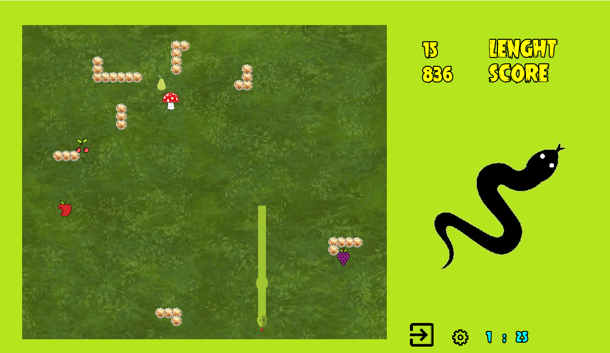

# Table of contents
* [About](#about)
* [Tools used](#tools-used)
* [Download](#download)
* [Further development](#further-development)
* [License](#license)
* [Copyrights](#Copyrights)

## About

The application is written in C++ and uses SFML as a graphics library.

## Tools used
* C++
* Visual Studio
* SFML

## Download
simply download snakeGame.exe or build the project yourself
1.
## Further development

## License

## Copyrights
game song : The Coconut Song - (Da Coconut Nut)
